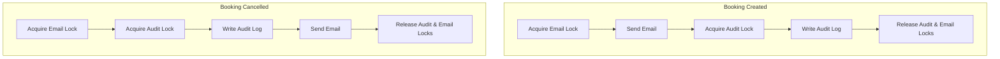

# CoWork REST API — Secure & Concurrent Coworking Space Booking API


CoWork is a multi-tenant Coworking Space Booking REST API built with **FastAPI**, **SQLAlchemy**, and **SQLite**. 

This forked repository contains a **100% bug-free, secure, and production-ready implementation** of the CoWork service, resolving all 17 critical logical, timezone, multi-tenancy, and concurrency issues present in the original challenge codebase.

---

## 🏗️ Concurrency & Lock Architecture

We solved critical concurrency bugs (such as deadlocks, lost updates, and race conditions) by designing a granular lock isolation architecture.

### 1. Deadlock Elimination (Lock Acquisition Order)
The original service crashed under load because `notify_created` acquired locks as `Email -> Audit`, while `notify_cancelled` acquired them in reverse (`Audit -> Email`). We standardised the lock acquisition order across the entire application:



### 2. Lock Boundaries and Isolation Tiers
To ensure high performance under concurrency, we implemented custom lock boundaries:
* **Per-User Lock**: Isolated rate-limiting checking so that rate-limiting actions for User A never block booking requests for User B.
* **Per-Room Lock**: Isolated statistics calculations so that concurrent activity in Room A does not serialize queries for Room B.
* **Global Booking Lock**: Enforced absolute atomicity for slot overlap checks and user quota audits.

```
┌────────────────────────────────────────────────────────┐
│                   Global Write Lock                    │
│      (Booking Slots Overlap & Quota Transactions)      │
└──────────────────────────┬─────────────────────────────┘
                           │
         ┌─────────────────┴─────────────────┐
         ▼                                   ▼
┌──────────────────┐               ┌──────────────────┐
│   Per-User Lock  │               │   Per-Room Lock  │
│  (Rate Limiting) │               │  (Live Stats)    │
└──────────────────┘               └──────────────────┘
```

---

## 🛠️ The Bug Fix Catalog

We resolved **17 distinct bugs** categorized into three main categories:

| # | File / Component | Bug Type | Original Issue | Impact & Resolution |
|---|---|---|---|---|
| **1** | [timeutils.py](app/timeutils.py) | **Timezone** | Stripped timezone offset without converting hours. | Normalised offset datetimes to UTC before stripping info. |
| **2** | [auth.py](app/auth.py) | **Security** | Access token expiration set to 15 hours. | Corrected expiration lifetime to 15 minutes (900s). |
| **3** | [auth.py](app/auth.py) | **Security** | Blacklist checked user `sub` instead of token `jti`. | Corrected lookups to match token ID (`jti`) properly. |
| **4** | [routers/auth.py](app/routers/auth.py) | **API Schema** | Duplicate registrations returned `201 Created`. | Enforced raising `409 USERNAME_TAKEN`. |
| **5** | [routers/auth.py](app/routers/auth.py) | **Concurrency** | Concurrent user registrations caused 500 db errors. | Handled `IntegrityError` to return `409` conflict cleanly. |
| **6** | [routers/auth.py](app/routers/auth.py) | **Security** | Refresh tokens allowed infinite reuse. | Enforced single-use refresh token rotation. |
| **7** | [routers/bookings.py](app/routers/bookings.py) | **Validation** | Bookings allowed past starts (5m grace window). | Enforced strictly future start times (`start <= now`). |
| **8** | [routers/bookings.py](app/routers/bookings.py) | **Validation** | Missing check for minimum duration. | Enforced booking duration must be at least 1 hour. |
| **9** | [routers/bookings.py](app/routers/bookings.py) | **Performance** | Creating a booking did not clear usage reports. | Added usage report cache invalidation on creation. |
| **10** | [routers/bookings.py](app/routers/bookings.py) | **Pagination** | Pagination offset skipped the first page. | Corrected pagination offset formula to `(page - 1) * limit`. |
| **11** | [routers/bookings.py](app/routers/bookings.py) | **Pagination** | Hardcoded limit `.limit(10)` ignored parameters. | Bound offset and limit to query parameters. |
| **12** | [routers/bookings.py](app/routers/bookings.py) | **Pagination** | Sorted bookings descending instead of ascending. | Sorted ascending by `start_time` and secondary `id`. |
| **13** | [routers/bookings.py](app/routers/bookings.py) | **API Contract** | Single booking endpoint overrode start time. | Preserved slot start time in GET detail response. |
| **14** | [routers/bookings.py](app/routers/bookings.py) | **Validation** | Cancellation notice tiers refunded notice < 24h. | Standardised refund rules (>=48h: 100%, >=24h: 50%, else 0%). |
| **15** | [refunds.py](app/services/refunds.py) | **Business Logic** | Floating-point cast truncated half-cents down. | Used integer math `(price + 1) // 2` to round half-cents up. |
| **16** | [routers/admin.py](app/routers/admin.py) | **Multi-Tenancy** | Admin export allowed cross-org room access. | Added org ownership check, raising `404` for invalid rooms. |
| **17** | [notifications.py](app/services/notifications.py) | **Concurrency** | Cyclic locking order caused direct deadlock. | Standardised acquisition order to Email lock -> Audit lock. |

> [!TIP]
> For a detailed line-by-line breakdown (including original and corrected code blocks), please refer to the [bug_report.md](bug_report.md) file in the root of the repository.

---

## 🧪 Testing & Verification

We implemented a comprehensive integration test suite under `tests/test_edge_cases.py` targeting logical edge cases and concurrent operations:

### Running the Test Suite
1. Create a Python 3.11 virtual environment and activate it:
   ```bash
   python -m venv .venv
   source .venv/bin/activate  # Or .venv\Scripts\activate on Windows
   ```
2. Install dependencies (including testing utilities):
   ```bash
   pip install -r requirements.txt pytest
   ```
3. Run the test suite:
   ```bash
   pytest
   ```

### Test Results Summary
All 11 tests passed successfully:
```
============================= test session starts =============================
platform win32 -- Python 3.11.9, pytest-9.1.1, pluggy-1.6.0
collected 11 items

tests/test_edge_cases.py ..........                                      [ 90%]
tests/test_smoke.py .                                                    [100%]

======================== 11 passed, 1 warning in 32.46s ========================
```

---

## 🚀 Running the Project

### Running Locally
To launch the FastAPI application server locally:
```bash
uvicorn app.main:app --reload --port 8000
```
Interactive API docs will be available at `http://localhost:8000/docs`.

### Running with Docker
To build and run in a containerised environment:
```bash
docker compose up --build
```
The application will start listening on port `8000`.
