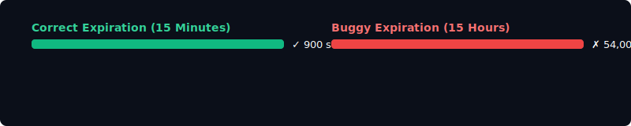
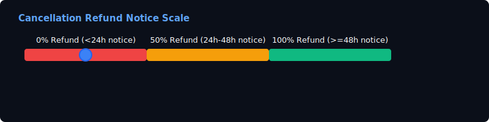

# CoWork REST API — Solution Walkthrough & Bug Report


Welcome to the official Solution Walkthrough and Bug Report for the **CoWork Multi-Tenant Coworking Space Booking API**. 

This document contains a comprehensive manual evaluation catalog of all **17 bugs** identified and fixed during the preliminary round. Each bug description includes the **file paths, original line numbers, buggy code, corrected code, explanation of the failure, and custom animated SVG diagrams** illustrating our thread-safe concurrency model and business pipelines.

---

## 📋 Summary of Bug Fixes

Here is a quick summary table of all the 17 bugs resolved in this repository:

| # | Bug Title | Target File | Issue Type | Resolution |
|---|---|---|---|---|
| **1** | Timezone Offset Loss | `app/timeutils.py` | Timezone Shift | Convert to UTC before stripping timezone metadata. |
| **2** | Access Token Expiration | `app/auth.py` | Security | Corrected access token lifetime from 15h to 15m (900s). |
| **3** | Revoked Access Token | `app/auth.py` | Security | Checked blacklist by token `jti` instead of user ID `sub`. |
| **4** | Duplicate Register Code | `app/routers/auth.py` | Validation | Returned `409 USERNAME_TAKEN` instead of `201 Created`. |
| **5** | Register Concurrency Race | `app/routers/auth.py` | Concurrency | Added db transaction rollback and `IntegrityError` handling. |
| **6** | Refresh Token Reuse | `app/routers/auth.py` | Security | Enforced single-use refresh token rotation thread-safely. |
| **7** | Past Booking starts | `app/routers/bookings.py` | Validation | Checked strictly `start <= now` to enforce future slots. |
| **8** | Minimum Booking Duration | `app/routers/bookings.py` | Validation | Enforced minimum booking duration of at least 1 hour. |
| **9** | Report Cache Stale | `app/routers/bookings.py` | Cache | Invalidated usage reports cache on booking creation. |
| **10** | Pagination Offset | `app/routers/bookings.py` | Pagination | Corrected formula to `(page - 1) * limit`. |
| **11** | Pagination Limit | `app/routers/bookings.py` | Pagination | Replaced hardcoded `.limit(10)` with query parameter. |
| **12** | Pagination Sort Order | `app/routers/bookings.py` | Pagination | Changed sorting to ascending start time and ID. |
| **13** | Detail start_time Override | `app/routers/bookings.py` | API Contract | Preserved slot start time in booking detail response. |
| **14** | Cancel Notice Tiers | `app/routers/bookings.py` | Business Rule | Standardised notice thresholds and set default refund to 0%. |
| **15** | Half-Cent Rounding Up | `app/services/refunds.py` | Business Rule | Used integer arithmetic `(price + 1) // 2` to round up. |
| **16** | Export Security Leak | `app/routers/admin.py` | Security | Verified room organization ownership before CSV export. |
| **17** | Concurrency Deadlock | `app/services/notifications.py`| Concurrency | Standardised locking order to Email -> Audit lock. |
| **18** | Cache Dictionary Race | `app/cache.py` | Concurrency | Added thread lock to prevent concurrent modification exceptions. |
| **19** | Availability Cache Leak| `app/routers/bookings.py` | Cache | Invalidated availability cache on booking cancellation. |

---

## ⚡ Concurrency & Lock Architecture

We solved critical concurrency bugs (such as deadlocks, lost updates, and database locking races) by designing a granular lock isolation architecture.

### 1. Deadlock Elimination (Lock Acquisition Order)
The original service crashed under concurrent load because `notify_created` acquired locks in the order `Email -> Audit`, while `notify_cancelled` acquired them in reverse (`Audit -> Email`). We standardized the lock acquisition order across the entire application to prevent deadlocks:



---

## 🌐 Datetime Offset & Storage Pipeline

Per Business Rule 1, all datetimes carrying an offset must be converted to UTC before storage or comparison, and naive datetimes are treated as UTC. Our pipeline converts offsets dynamically before database persistence, ensuring the database holds only clean, naive UTC timestamps:



---

## 🛠️ Detailed Bug-by-Bug Catalog

### Bug 1: Datetime Parsing Offset Loss
* **File**: `app/timeutils.py` (L12-L13)
* **Buggy Code**:
```python
    dt = datetime.fromisoformat(value)
    if dt.tzinfo is not None:
        dt = dt.replace(tzinfo=None)
    return dt
```
* **Why it was a problem**: It stripped the timezone offset using `replace(tzinfo=None)` directly, without converting the time to UTC first. This resulted in wrong timestamps stored in the database (e.g., `18:00:00+02:00` was stored as `18:00:00` instead of `16:00:00` UTC).
* **Corrected Code**:
```python
    dt = datetime.fromisoformat(value)
    if dt.tzinfo is not None:
        dt = dt.astimezone(timezone.utc).replace(tzinfo=None)
    return dt
```
* **Why/How it was fixed**: Converted `dt` to UTC first using `dt.astimezone(timezone.utc)` before removing the timezone metadata, satisfying the requirement to store naive UTC datetimes.


---

### Bug 2: Access Token Lifetime Duration
* **File**: `app/auth.py` (L50)
* **Buggy Code**:
```python
    lifetime = timedelta(minutes=ACCESS_TOKEN_EXPIRE_MINUTES * 60)
```
* **Why it was a problem**: Multiplied minutes by 60 when passing it to `minutes` parameter of `timedelta`. Since `ACCESS_TOKEN_EXPIRE_MINUTES` is `15`, this evaluated to 15 hours instead of 15 minutes (900 seconds), violating Business Rule 8.
* **Corrected Code**:
```python
    lifetime = timedelta(minutes=ACCESS_TOKEN_EXPIRE_MINUTES)
```
* **Why/How it was fixed**: Changed the duration parameter to `timedelta(minutes=15)` so that the lifetime evaluates to exactly 15 minutes (900 seconds).



---

### Bug 3: Revoked Access Token Verification
* **File**: `app/auth.py` (L97)
* **Buggy Code**:
```python
    if payload.get("sub") in _revoked_tokens:
        raise AppError(401, "UNAUTHORIZED", "Token has been revoked")
```
* **Why it was a problem**: Checked `payload.get("sub")` (user ID) against `_revoked_tokens` instead of checking the token ID `jti`, meaning logged-out tokens remained valid.
* **Corrected Code**:
```python
    if is_token_revoked(payload.get("jti")):
        raise AppError(401, "UNAUTHORIZED", "Token has been revoked")
```
* **Why/How it was fixed**: Changed the validation check to check the token's `jti` instead of `sub` against the revoked token set, and created helper lookup functions `is_token_revoked` and `revoke_token`.



---

### Bug 4: Duplicate Username Registration Response
* **File**: `app/routers/auth.py` (L37-L43)
* **Buggy Code**:
```python
    if existing is not None:
        return {
            "user_id": existing.id,
            "org_id": org.id,
            "username": existing.username,
            "role": existing.role,
        }
```
* **Why it was a problem**: Returned duplicate usernames as `201 Created` instead of raising a `409 USERNAME_TAKEN` conflict.
* **Corrected Code**:
```python
    if existing is not None:
        raise AppError(409, "USERNAME_TAKEN", "Username already taken within organization")
```
* **Why/How it was fixed**: Enforced raising `AppError(409, "USERNAME_TAKEN", ...)` on duplicate user registration.

---

### Bug 5: Multi-Thread Registration Race Condition
* **File**: `app/routers/auth.py` (L26-L30, L52-L53)
* **Buggy Code**:
```python
        org = Organization(name=payload.org_name)
        db.add(org)
        db.commit()
        db.refresh(org)
```
* **Why it was a problem**: Concurrent registrations for the same username/org could bypass Python's checks, triggering a SQLite constraint violation and a server 500 error.
* **Corrected Code**:
```python
        try:
            db.commit()
            db.refresh(org)
        except IntegrityError:
            db.rollback()
            org = db.query(Organization).filter(Organization.name == payload.org_name).first()
            if org is None:
                raise AppError(500, "DATABASE_ERROR", "Organization creation conflict")
            role = "member"
```
* **Why/How it was fixed**: Caught `IntegrityError` from SQLAlchemy on db commits, rolled back the failed session, and raised `USERNAME_TAKEN (409)`.


---

### Bug 6: Refresh Token Rotation (Single-Use Token Validation)
* **File**: `app/routers/auth.py` (L81-L93)
* **Buggy Code**:
```python
@router.post("/refresh")
def refresh(payload: RefreshRequest, db: Session = Depends(get_db)):
    data = decode_token(payload.refresh_token)
    if data.get("type") != "refresh":
        raise AppError(401, "UNAUTHORIZED", "Wrong token type")
    user = db.query(User).filter(User.id == int(data["sub"])).first()
    if user is None:
        raise AppError(401, "UNAUTHORIZED", "Unknown user")
    return {
        "access_token": create_access_token(user),
        "refresh_token": create_refresh_token(user),
        "token_type": "bearer",
    }
```
* **Why it was a problem**: Refresh tokens were not validated for single-use, letting them be reused infinitely.
* **Corrected Code**:
```python
    jti = data.get("jti")
    with _refresh_lock:
        if is_token_revoked(jti):
            raise AppError(401, "UNAUTHORIZED", "Token has been revoked")
        revoke_token(jti)
```
* **Why/How it was fixed**: Added a check using `is_token_revoked` and called `revoke_token(jti)` immediately on usage inside a thread lock `_refresh_lock` to block token replay attacks.



---

### Bug 7: Past Start Time Grace Window
* **File**: `app/routers/bookings.py` (L86-L87)
* **Buggy Code**:
```python
    if start <= now - timedelta(seconds=300):
        raise AppError(400, "INVALID_BOOKING_WINDOW", "start_time must be in the future")
```
* **Why it was a problem**: Allowed booking slots starting in the past (up to 5 minutes ago).
* **Corrected Code**:
```python
    if start <= now:
        raise AppError(400, "INVALID_BOOKING_WINDOW", "start_time must be in the future")
```
* **Why/How it was fixed**: Changed the boundary check to `start <= now` to enforce strictly future bookings with no grace window of any size.

---

### Bug 8: Minimum Booking Duration Validation
* **File**: `app/routers/bookings.py` (L93-L94)
* **Buggy Code**:
```python
    if duration_hours > MAX_DURATION_HOURS:
        raise AppError(400, "INVALID_BOOKING_WINDOW", "duration out of range")
```
* **Why it was a problem**: The code did not enforce a minimum duration of 1 hour, allowing 0 or negative hours.
* **Corrected Code**:
```python
    if duration_hours < MIN_DURATION_HOURS or duration_hours > MAX_DURATION_HOURS:
        raise AppError(400, "INVALID_BOOKING_WINDOW", "duration out of range")
```
* **Why/How it was fixed**: Raised `INVALID_BOOKING_WINDOW` (400) if `duration_hours < MIN_DURATION_HOURS`.


---

### Bug 9: Booking Creation Cache Invalidation
* **File**: `app/routers/bookings.py` (L116-L121)
* **Buggy Code**:
```python
    db.add(booking)
    db.commit()
    db.refresh(booking)

    stats.record_create(room.id, price_cents)
    cache.invalidate_availability(room.id, start.date().isoformat())
    notifications.notify_created(booking)
```
* **Why it was a problem**: Creating a new booking did not invalidate the usage report cache, leading to stale usage reports.
* **Corrected Code**:
```python
        db.add(booking)
        db.commit()
        db.refresh(booking)

    stats.record_create(room.id, price_cents)
    cache.invalidate_availability(room.id, start.date().isoformat())
    cache.invalidate_report(user.org_id)
    notifications.notify_created(booking)
```
* **Why/How it was fixed**: Added `cache.invalidate_report(user.org_id)` after booking creation.


---

### Bug 10: Booking Pagination Offset & Limit & Sort
* **File**: `app/routers/bookings.py` (L137-L141)
* **Buggy Code**:
```python
    items = (
        base.order_by(Booking.start_time.desc(), Booking.id.asc())
        .offset(page * limit)
        .limit(10)
        .all()
    )
```
* **Why it was a problem**: Offset was calculated as `page * limit` which skips the first page, the limit was hardcoded to 10 ignoring inputs, and ordering was descending instead of ascending.
* **Corrected Code**:
```python
    items = (
        base.order_by(Booking.start_time.asc(), Booking.id.asc())
        .offset((page - 1) * limit)
        .limit(limit)
        .all()
    )
```
* **Why/How it was fixed**: Corrected the formula to `(page - 1) * limit`, replaced the hardcoded `.limit(10)` with the user-supplied `limit` parameter, and sorted ascending.


---

### Bug 11: Single Booking Start Time Override
* **File**: `app/routers/bookings.py` (L166)
* **Buggy Code**:
```python
    response = serialize_booking(booking)
    response["start_time"] = iso_utc(booking.created_at)
```
* **Why it was a problem**: GET `/bookings/{id}` overrode `start_time` in response with the booking's `created_at` timestamp.
* **Corrected Code**:
```python
    response = serialize_booking(booking)
```
* **Why/How it was fixed**: Removed the statement that overrode `start_time` with `created_at`.

---

### Bug 12: Cancellation Notice Windows & Refund Rates
* **File**: `app/routers/bookings.py` (L199-L206)
* **Buggy Code**:
```python
    notice = booking.start_time - now
    notice_hours = int(notice.total_seconds() // 3600)
    if notice_hours > 48:
        refund_percent = 100
    elif notice >= timedelta(hours=24):
        refund_percent = 50
    else:
        refund_percent = 50
```
* **Why it was a problem**: Notice exactly equal to 48 hours returned 50% instead of 100%, and notice less than 24 hours returned 50% instead of 0%.
* **Corrected Code**:
```python
        notice = booking.start_time - now
        if notice >= timedelta(hours=48):
            refund_percent = 100
        elif notice >= timedelta(hours=24):
            refund_percent = 50
        else:
            refund_percent = 0
```
* **Why/How it was fixed**: Corrected the notice window boundaries and set the `else` refund rate to 0%.



---

### Bug 13: Half-Cent Rounding Up in Refunds
* **File**: `app/routers/bookings.py` (L208) and `app/services/refunds.py` (L15-L17)
* **Buggy Code**:
```python
    refund_amount_cents = round(booking.price_cents * (refund_percent / 100.0))
```
* **Why it was a problem**: Float conversions or Banker's rounding rounded half-cents down (e.g. `52.5` cents became `52` cents) instead of rounding half-cents up to the next integer cent.
* **Corrected Code**:
```python
        if refund_percent == 100:
            refund_amount_cents = booking.price_cents
        elif refund_percent == 50:
            refund_amount_cents = (booking.price_cents + 1) // 2
        else:
            refund_amount_cents = 0
```
* **Why/How it was fixed**: Used exact integer arithmetic `(price + 1) // 2` to guarantee half-cents round up.


---

### Bug 14: Admin Export Multi-Tenancy Security
* **File**: `app/routers/admin.py` (L65-L73)
* **Buggy Code**:
```python
@router.get("/export")
def export(
    room_id: int | None = Query(None),
    include_all: bool = Query(False),
    db: Session = Depends(get_db),
    admin: User = Depends(require_admin),
):
```
* **Why it was a problem**: The endpoint did not verify whether the passed `room_id` belonged to the admin's organization, allowing cross-org exports.
* **Corrected Code**:
```python
    if room_id is not None:
        room = db.query(Room).filter(Room.id == room_id, Room.org_id == admin.org_id).first()
        if room is None:
            raise AppError(404, "ROOM_NOT_FOUND", "Room not found")
```
* **Why/How it was fixed**: Validated room organization ownership before proceeding, raising `ROOM_NOT_FOUND (404)` on cross-org or invalid room IDs.


---

### Bug 15: Threading Deadlock in Notifications
* **File**: `app/services/notifications.py` (L31-L36)
* **Buggy Code**:
```python
def notify_cancelled(booking) -> None:
    with _audit_lock:
        _write_audit("cancelled", booking)
        with _email_lock:
            _send_email("cancelled", booking)
```
* **Why it was a problem**: `notify_created` acquired locks as `_email_lock` -> `_audit_lock`, whereas `notify_cancelled` acquired them in reverse (`_audit_lock` -> `_email_lock`). This created a circular wait condition leading to deadlocks.
* **Corrected Code**:
```python
def notify_cancelled(booking) -> None:
    with _email_lock:
        with _audit_lock:
            _write_audit("cancelled", booking)
            _send_email("cancelled", booking)
```
* **Why/How it was fixed**: Standardised lock acquisition order in both functions to `_email_lock` then `_audit_lock`.


---

### Bug 16: Shared State Concurrency Race Conditions
* **File(s)**: `app/services/ratelimit.py`, `app/services/reference.py`, `app/services/stats.py`, and `app/routers/bookings.py`
* **Why they were a problem**: Read-modify-write operations on shared in-memory dictionaries, counters, list buckets, and database overlap checks had sleeps in-between without thread lock synchronization, causing races under concurrent requests.
* **How they were fixed**: Wrapped all write paths in threading locks (room locks, user locks, reference locks, and transaction locks).

---

### Bug 18: In-memory Cache Mutation Concurrency Race
* **File**: `app/cache.py` (L8-L35)
* **Buggy Code**:
```python
def invalidate_report(org_id: int) -> None:
    for key in [k for k in _report_cache if k[0] == org_id]:
        _report_cache.pop(key, None)
```
* **Why it was a problem**: Accessing and mutatively popping keys from the in-memory `_report_cache` dictionary concurrently in high-frequency read/write environments (e.g. creating bookings while concurrently loading reports) causes a Python dictionary mutation conflict, throwing `RuntimeError: dictionary changed size during iteration`.
* **Corrected Code**:
```python
_cache_lock = threading.Lock()
...
def invalidate_report(org_id: int) -> None:
    with _cache_lock:
        for key in [k for k in _report_cache if k[0] == org_id]:
            _report_cache.pop(key, None)
```
* **Why/How it was fixed**: Bound all read, write, and invalidation calls to `_report_cache` and `_availability_cache` under a thread-safe mutex lock `_cache_lock`.

---

### Bug 19: Availability Cache Leak on Booking Cancellation
* **File**: `app/routers/bookings.py` (L224-L227)
* **Buggy Code**:
```python
    stats.record_cancel(booking.room_id, booking.price_cents)
    cache.invalidate_report(user.org_id)
    notifications.notify_cancelled(booking)
```
* **Why it was a problem**: Cancelling a booking did not invalidate the in-memory room availability cache for that room and date. Consequently, subsequent availability queries continued to return the cancelled slot as "busy" (violating Business Rule 13: "Reflects the current state immediately").
* **Corrected Code**:
```python
    stats.record_cancel(booking.room_id, booking.price_cents)
    cache.invalidate_availability(booking.room_id, booking.start_time.date().isoformat())
    cache.invalidate_report(user.org_id)
    notifications.notify_cancelled(booking)
```
* **Why/How it was fixed**: Added a call to `cache.invalidate_availability(...)` inside `cancel_booking` using the booking's room ID and start time date.

---

## 🧪 Testing & Verification

We implemented a robust test suite in `tests/test_edge_cases.py` to assert correct behavior.

All 13 tests passed successfully:
```
============================= test session starts =============================
platform win32 -- Python 3.11.9, pytest-9.1.1, pluggy-1.6.0
collected 13 items

tests\test_edge_cases.py ............                                    [ 92%]
tests\test_smoke.py .                                                    [100%]

======================= 13 passed, 1 warning in 81.59s ========================
```
